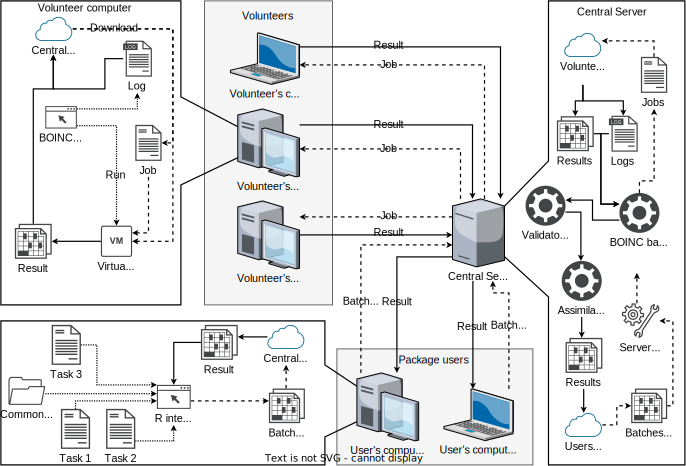
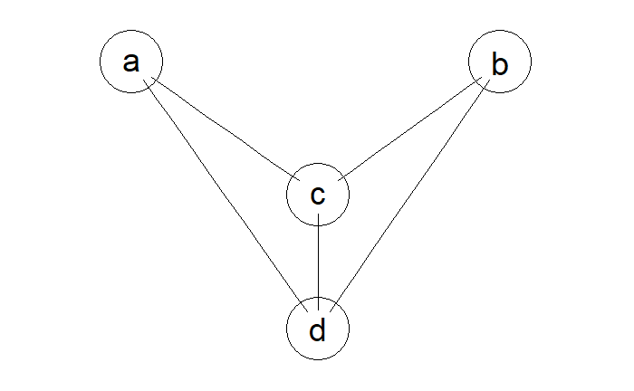

# Высокоуровневая архитектура
В этом разделе описывается общая архитектура RBOINC. Информация в этом разделе предназначена только для администраторов BOINC проектов и волонтёров, которые хотят установить RBOINC или участвовать в проектах, основанных на нём соотвественно. Если вы являетесь волонтёром, перейдите к подразделу [Компьютеры волонтёров](#volunteers_computers). Если вы не являетесь администратором своего проекта BOINC, [пропустите](#RBOINC.cl) этот раздел.

## Как работает RBOINC
RBOINC Можно разделить на 3 части:

* Серверная часть. Представляет из себя набор скриптов, демонов и конфигурационных файлов, которые дополняют оригинальный BOINC и предоставляют пакету R интерфейсы для создания заданий.
* Пакет R. Предоставляет пользователям высокоуровневые функции для создания заданий с помощью BOINC. 
* Виртуальная машина. Запускаяется на компьютерах волонтёров и выполняет задания.

Схематично  работу RBOINC можно изобразить так:

Всё начинается на компьютерах пользователей. Пользователь открывает интерпритатор R и создаёт пачку заданий, передавая данные, код и т.д. Пакет RBOINC.cl собирает всё необходимое для выполнения заданий в архив и отсылает серверу BOINC. Сервер распоковывает архив и регистрирует задания. После этого компьютеры волонтёров запрашивают задания у сервера, скачивают их, дополнительно загружают виртуальную машину и запускают её. Виртуальная машина запускает интерпритатор R и выполняет задание. После завершения обработки файл с результатами загружается на сервер. Сервер проверяет файл валидатором и при успешной проверке помещает его в папку с результатами. Пользователь может забрать результаты расчётов в любое время.

## Виртуальная машина
Изначально предполагалось, что тот, кто захочет использовать пакет RBOINC должен самостоятельно собрать виртуальную машину. Теперь предполагается, что вы возьмёте готовую, заранее настроенную ВМ и просто доустановите необходимые пакеты и ПО. Далее описывается досборка готовой ВМ. Инструкцию по сборке ВМ с нуля ищите в подразделе [сборка виртуальной машины с нуля](#Build_vm_from_scratch).

### Досборка готовой виртуальной машины
Предварительно собранные виртуальные машины могут быть найдены по этой ссылке: https://disk.yandex.ru/d/e_aItFuMPfKF2A. Поддерживаются только архитекуры i686 и amd64. Обе ВМ собраны на основе Gentoo Linux.

Для каждой архитектуры я предоставляю 2 виртуальные машины:

* Суффикс "release" означает, что ВМ предназначена для загрузки на сервер BOINC. Она включает в себя базовый набор пакетов, необходимый для работы виртуальной машины на компьютерах волонтёров. В R установлены только базовые пакеты, пакет "doParallel" и его зависимости.

* Виртуалки без суффикса предназначены для технического обслуживани и последующей сборки релизной версии. Эти ВМ содержат всё то-же, что и версии с суффиксом "relese", плюс дополнительные пакеты и файлы необходимые для полноценной работы ОС.

Рекомендуемый способ досборки зависит от того, что вам нужно поменять в образах виртуальных машин:

* Если необходимо только установить дополнительные пакеты R, которые не требуют библиотек за исключением тех, что уже установлены в ВМ, то алгоритм следующий:

  1. Скачать "release" версию виртуальной машины.
  
  1. Загрузить её. После загрузки вам необходимо будет перехватить управление, прервав исполнение скрипта выполнения работы, успев нажать Ctrl+C (у вас на это 1 секунда).
  
  1. Переключиться на второй терминал с помощью Ctrl+Alt+F2.
  
  1. Войти с логином "root" и паролем "0000".
  
  1. Запустить R и установить необходимые пакеты.
  
  1. Завершить работу, выполнив "shutdown -hP now".
  
* Если необходимо установить дополнительное ПО, то алгоритм следуюший:

  1. Скачать версию ВМ без суффикса "release".
  
  1. Загрузить её. Переключиться на второй терминал с помощью Ctrl+Alt+F2.
  
  1. Войти с логином "root" и паролем "0000".
  
  1. Установить/обновить необходимое ПО и пакеты R.
  
  1. Выполнить скрипт "prepare_release.sh", находящийся в домашней директории root.
  
  1. Сделать снимок состояния машины. Выполнить скрипт "make_release.sh"
  
  1. Завершить работу, выполнив "shutdown -hP now".
  
  1. Скачать соотвествующей архитектуре Admin CD: https://www.gentoo.org/downloads/.
  
  1. Подключить пустой виртуальный жёсткий диск и Admin CD к виртуалке.
  
  1. Загрузиться с Admin CD.
  
  1. Разметить пустой диск: раздел UEFI 2 мб, раздел boot 32 Мб, остальное - rootfs.
  
  1. Файловые системы: boot - ext2, rootfs - btrfs с опциями "-M -s 4096 -n 4096 -O skinny-metadata,no-holes"
  
  1. Смонтировать: /dev/new3 -> /mnt/new с параметром "compress-force=zstd:15", /dev/new2 -> /boot, /dev/old3 -> /mnt/old, /dev/old2 /mnt/old/boot
  
  1. Скопировать данные из старой ФС в новую, например так: "rsync -avxHAXW /mnt/old/ /mnt/new/", "rsync -avxHAXW /mnt/old/boot/ /boot/"
  
  1. Восстановить загрузчик. Admin CD в отличие от Minimal installation CD содержит grub2, и поэтому восстановление выполняется в два этапа:
  
    1. Установка загрузчика: "grub-install --themes=none --compress=xz /dev/new"
    
    1. Запись правильных UUID в файл /boot/grub/grub.cfg 
    
  1. Проверьте, что ВМ загружается с нового диска. Сборка закончена.

### Сборка виртуальной машины с нуля {#Build_vm_from_scratch}
Сборка виртуальной машины с нуля занимает намного больше времени, чем обновление готовой. Однако такая ВМ может иметь преимущества: вы можете использовать любой дистрибутив Linux или даже любую другую ОС. Единственное требование - в выбранной вами операционной системе должен работать интерпритатор R. Перед сборкой вртуальной машины убедитесь, что лицензия ОС позволяет выполнять с ней подобные действия, в частности распространять неограниченному кругу лиц и модифицировать.

В целом сборку с нуля можно разделить на следующие этапы:

1. Уставновите операционную систему в виртуальную машину.

1. Установите гостевые дополнения VirtualBox.

1. Установите интерпритатор R.

1. Добавьте в автомонтирование при загрузке глобальную папку VirtualBox с именем shared.

1. Если ваша система Linux, то вы можете просто добавить файл boinc/boinc_app.sh в автозагрузку. Только убедитесь, что вы выполняете монтирование папки shared в место, которое ожидает скрипт и созданы все необходимые папки, которые ожидает скрипт. Если ваша система не linux, то перепишите этот скрипт так, что-бы сохранилась логика его работы.

1. В зависимости от вашей ОС вам могут потребоваться дополнительные действия. Смотрите HowToInstall.txt в папке back-end/VM.

## Серверная часть
Серверная часть состоит из компонентов, которые реализуют функции, или не предоставляемые BOINC, или более удобные для использования в этом пакете обёртки над интерфейсами BOINC. Серверная часть должна быть установлена на проект BOINC до создания заданий. Обратите внимание на то, что серверная часть включает в себя стороннии компоненты, которые могут лицензироваться на условиях лицензий, отличных от BSD3.

Установка компонентов заключается в копировании содержимого папки "/back-end/Server/project" в директорию вашего проекта BOINC и последующем редактировании конфигурационных файлов.

### Валидатор
В серверную часть входит валидатор, который выполняет простейшие проверки присланных заданий. Для его сборки скопируйте папку "validator" в папку с исходными файлами BOINC, перейдите в папку "validator" и выполните "make". Предполагается, что перед этим BOINC был сконфигурирован и собран(См. https://boinc.berkeley.edu/trac/wiki/ServerIntro).

Этот валидатор требует установки интерпритатора R на сервер. В будущем это требование может стать необязательным, а может и не стать. В качестве альтернативы можно использовать sample_trivial_validator из стандартной поставки BOINC.

### Папка apps
В этой директории находятся файлы приложений. Обратите внимание, что ВМ не хранится в репозитории и должна быть скачана и добавлена отдельно. Это сделано из-за того, что ВМ часто меняется и занимает много места.

Официально поддериваются только ОС семейства Linux и Windows, использующие ахитектуры amd64 и i686. Теоретически возможна поддержка MacOS, с теми-же архитектурами (см. https://boinc.berkeley.edu/trac/wiki/VboxApps) но я не нашёл компьютера с ней для тестирования и отладки.

### Папка rboinc
Содержит файлы, которые изначально были созданы для ssh протокола и предоставляли функции, к которым не было прямого доступа из командной оболочки. Позже они были расширены и теперь предоставляют дополнительно функции для пакета, в первую очередь это генерация уникальных имён для файлов и пачек заданий.

### Файл html/user/rboinc_upload_archive.php
Предоставляет низкоуровневый(но более высокоуровневый, чем оригинальный интерфейс BOINC) интерфейс для загрузки файлов на сервер BOINC по http/https протоколам. Дополнительно сообщает пакету имя для создания пачки работ.

### Папка templates
Шаблоны для входных и выходных файлов BOINC. Подробнее см. в https://boinc.berkeley.edu/trac/wiki/JobTemplates.

## Компьютеры волонтёров {#volunteers_computers}
Подготовка компьютера волонтёра к работе с проектом, основанным на RBOINC достаточно проста. Необходимо установить BOINC Manager, VirtualBox и VirtualBox Extension Pack, а также включить аппаратную виртуализацию в настройках BIOS/UEFI. После установки необходимого ПО рекомендуется выполнить перезагрузку. После этого проект можно добавлять в BOINC Manager. 

Также рекомендуется добавить в запуск по расписанию каждые несколько минут команду "boinccmd --project \<Project URL\> update". В данный момент у проекта есть некоторые проблемы связанные с тем, что в определённый момент число заданий на сервере может стать нулевым. В этом случае BOINC Client перестаёт запрашивать новые задания и заставить его это сделать можно или ручным обновлением проекта или перезагузкой компьютера. Я не нашёл решения этой проблемы в документации BOINC, если знаете, как её решить - пошлите мне письмо на почту или добавьте feature request в репозитории RBOINC. 

Если ваша операционная система Ubuntu и выполнении заданий завершается с ошибкой "Postponed: VM job unmanageable, restarting later", то добавьте в атозагрузку запуск "vboxwebsrv" от пользователя "boinc" и перезагрузите компьютер. Тоже самое необходимо сделать, если все задания завершаются с ошибкой "NS_ERROR_SOCKET_FAIL". Если вашей системой инициализации является systemd, то это можно сделать следующим образом (все действия необходимо выполнять от root):

1. Создать файл "/etc/systemd/system/run-vbox-as-boinc.service" со следующим содержимым:

```
[Unit]
Description=Run vboxwebsrv as user boinc
DefaultDependencies=no
After=network.target  

[Service]  
Type=simple
User=boinc 
Group=boinc
ExecStart=/usr/bin/vboxwebsrv
TimeoutStartSec=0  
RemainAfterExit=yes

[Install]
WantedBy=default.target
```
2. Выполнить команды:
   1. systemctl daemon-reload
   1. systemctl enable run-vbox-as-boinc
   1. service run-vbox-as-boinc start

Это может распространяться и на другие ОС семейства Linux. 

## Пакет R

Пакет RBOINC.cl это клиентская часть RBOINC. Он должен быть установлен на компьютеры клиентов, которые хотят запускать свои задания с помощью RBOINC. Для клиентов установка выполняется максимально просто, достаточно выполнить:
``` {r eval=FALSE}
install.packages(c('R.utils', 'askpass', 'foreach', 'httr', 'ssh', 'xml2',
                   'stats', 'utils', 'doParallel', 'parallel'))
install.packages("RBOINC.cl", repos="http://R-Forge.R-project.org")
```
Обратите внимание, что в данный момент пакет находится на стадии бета теста и его не рекомендуется использовать в продакшене. В дальнейшем планируется отправка пакета в CRAN.

Администратор проекта RBOINC должен предоставить клиенту следующую информацию:

* Если используется http/https протокол:
  * URL сервера
  * Путь до страницы проекта (без сервера).
  * Адрес почты и пароль клиент указывает сам при регистрации в проекте RBOINC. Администратор только выдаёт права на создание работы(см. https://boinc.berkeley.edu/trac/wiki/MultiUser).
* Если используется ssh протокол:
  * Адрес сервера
  * Путь до папки проекта
  * Логин и пароль клиента или файл ключа.

Для использования рекомендуется http интерфейс. Подробности о нём вы можете найти в https://boinc.berkeley.edu/trac/wiki/MultiUser. Обратите внимание, что вопреки тому, что написано на вики BOINC, высокоуровневое управление(файлы BOINC "manage_project.php" и "submit.php") этим интерфейсом недоделано. Тем не менее, на низком уровне, этот интерфейс работает и RBOINC.cl использует его для создания заданий и разграничений прав доступа.

Если вы собираетесь использовать ssh интерфейс, то вы должны добавить соответствующего пользователя в группы администратора вашего проекта и www-data, и установить его umask в значение, позволяющее другим пользователям из этих групп читать его файлы. В будущем это требование может быть убрано.

# Использование пакета R {#RBOINC.cl}

## Начало работы
В данный момент пакет находится в статусе беты. Установить его можно следующим образом:
``` {r eval=FALSE}
install.packages(c('R.utils', 'askpass', 'foreach', 'httr', 'ssh', 'xml2',
                   'stats', 'utils', 'doParallel', 'parallel'))
install.packages("RBOINC.cl", repos="http://R-Forge.R-project.org")
```
Для работы проекта вам необходима учётная запись с правами на создание работы. Обратитесь к администратору вашего проекта RBOINC для получения данных для авторизации.

## Функция test_jobs {#test_jobs_function}
Я начинаю с функции тестирования, потому что её можно использовать без необходимости в учётной записи в проекте RBOINC. Давайте посмотрим на определение функции:
```{r eval = FALSE}
test_jobs = function(work_func,
                     data = NULL,
                     n = NULL,
                     init_func = NULL,
                     global_vars = NULL,
                     packages = c(),
                     files = c(),
                     callback_function = NULL,
                     install_func = NULL)
```
Её параметры:

* work_func - функция обработки;
* data - данные для обработки;
* n - количество заданий;
* init_func - функция инициализации;
* global_vars - список глобальных переменных;
* packages - вектор с именами пакетов;
* files - вектор с именами файлов;
* callback_function - функция обратного вызова;
* install_func - функция установки.

Эта функция создаёт пачку заданий, но никуда её не отправляет. Вместо этого она выполняет все задания локально, последовательно переходя от одного задания к другому. Нет никаких гарантий, что если с помощью этой функции удалось выполнить задание, то его удастся выполнить с момощью реального сервера BOINC. Однако эта функция сильно упрощает написание кода, поскольку позволяет проверить задания на типичные ошибки, например отсутствующие пакеты, необъявленные объекты, опечатки в коде и т.д.

### Параметры work_func и data
Подключим пакет и выполним простейший код, умножающий вектор из 9 элементов на 5:
```{r eval=FALSE}
library(RBOINC.cl)

fun = function(val)
{
  return(val*5)
}

data = 1:9

res = test_jobs(fun, data)
```
```
## Testing archive making...	OK: /tmp/RtmpVolfKd/file7ae921bb5294.tar.xz
## Creating tmp dir for test...	OK: /tmp/RtmpVolfKd/file7ae93f09e93c
## Testing archive unpacking...	OK: founded files:
## 	/tmp/RtmpVolfKd/file7ae93f09e93c/common.tar.xz
## 	/tmp/RtmpVolfKd/file7ae93f09e93c/data/0.rda
## 	/tmp/RtmpVolfKd/file7ae93f09e93c/data/1.rda
## 	/tmp/RtmpVolfKd/file7ae93f09e93c/data/2.rda
## 	/tmp/RtmpVolfKd/file7ae93f09e93c/data/3.rda
## 	/tmp/RtmpVolfKd/file7ae93f09e93c/data/4.rda
## 	/tmp/RtmpVolfKd/file7ae93f09e93c/data/5.rda
## 	/tmp/RtmpVolfKd/file7ae93f09e93c/data/6.rda
## 	/tmp/RtmpVolfKd/file7ae93f09e93c/data/7.rda
## 	/tmp/RtmpVolfKd/file7ae93f09e93c/data/8.rda
## Searching jobs...	OK: 9
## Running job 0.rda in /tmp/RtmpVolfKd/file7ae921152c1b/0.rda OK
## Running job 1.rda in /tmp/RtmpVolfKd/file7ae921152c1b/1.rda OK
## Running job 2.rda in /tmp/RtmpVolfKd/file7ae921152c1b/2.rda OK
## Running job 3.rda in /tmp/RtmpVolfKd/file7ae921152c1b/3.rda OK
## Running job 4.rda in /tmp/RtmpVolfKd/file7ae921152c1b/4.rda OK
## Running job 5.rda in /tmp/RtmpVolfKd/file7ae921152c1b/5.rda OK
## Running job 6.rda in /tmp/RtmpVolfKd/file7ae921152c1b/6.rda OK
## Running job 7.rda in /tmp/RtmpVolfKd/file7ae921152c1b/7.rda OK
## Running job 8.rda in /tmp/RtmpVolfKd/file7ae921152c1b/8.rda OK
```
```{r eval=FALSE}
for(val in res){
  print(val$result)
}
```
```
## [1] 5
## [1] 10
## [1] 15
## [1] 20
## [1] 25
## [1] 30
## [1] 35
## [1] 40
## [1] 45
```

Функция создала 9 заданий, по числу элементов в data. Если параметр n не задан, то число заданий будет равно длине data.  data должен быть вектором или нумерованным списком. n должен быть меньше или равен длине data (но больше нуля). Если длина data не делится нацело на n, то у каких-то заданий окажется меньше работы. У work_func должен быть только 1 параметр, в который будет передан элемент data.

### Параметр n {#test_jobs_example_2}
Давайте создадим 2 задания вместо 9:
```{r  eval=FALSE}
library(RBOINC.cl)

fun = function(val)
{
  return(val*5)
}

data = 1:9

res = test_jobs(fun, data, 2)
```
```
## Testing archive making...    OK: /tmp/RtmpyNMQCo/file7e3c1e496b0b.tar.xz
## Creating tmp dir for test... OK: /tmp/RtmpyNMQCo/file7e3c7d82fd35
## Testing archive unpacking... OK: founded files:
##  /tmp/RtmpyNMQCo/file7e3c7d82fd35/common.tar.xz
##  /tmp/RtmpyNMQCo/file7e3c7d82fd35/data/0.rda
##  /tmp/RtmpyNMQCo/file7e3c7d82fd35/data/1.rda
## Searching jobs...    OK: 2
## Running job 0.rda in /tmp/RtmpyNMQCo/file7e3c34dca0ae/0.rda OK
## Running job 1.rda in /tmp/RtmpyNMQCo/file7e3c34dca0ae/1.rda OK
```
```{r eval=FALSE}
for(val in res){
  print(val$result)
}
```
```
## [1] 5
## [1] 10
## [1] 15
## [1] 20
## [1] 25
## [1] 30
## [1] 35
## [1] 40
## [1] 45
```
Функция обработки данных может быть рекурсивной. Давайте посчитаем факториал:
```{r eval=FALSE}
library(RBOINC.cl)

fac = function(val)
{
  if(val == 0 || val == 1){
    return(val)
  } else {
    return(val*fac(val- 1))
  }
}

data = 1:9

res = test_jobs(fac, data, 2)
```
```
## Testing archive making...    OK: /tmp/RtmpyNMQCo/file7e3c1e9c1f1.tar.xz
## Creating tmp dir for test... OK: /tmp/RtmpyNMQCo/file7e3c6ec56d11
## Testing archive unpacking... OK: founded files:
##  /tmp/RtmpyNMQCo/file7e3c6ec56d11/common.tar.xz
##  /tmp/RtmpyNMQCo/file7e3c6ec56d11/data/0.rda
##  /tmp/RtmpyNMQCo/file7e3c6ec56d11/data/1.rda
## Searching jobs...    OK: 2
## Running job 0.rda in /tmp/RtmpyNMQCo/file7e3c34ff944c/0.rda OK
## Running job 1.rda in /tmp/RtmpyNMQCo/file7e3c34ff944c/1.rda OK
```
``` {r eval=FALSE}
for(val in res){
  print(val$result)
}
```
```
## [1] 1
## [1] 2
## [1] 6
## [1] 24
## [1] 120
## [1] 720
## [1] 5040
## [1] 40320
## [1] 362880
```
### Пропуск параметра data, параметры global_vars и packages
Если вам не требуется какая-либо обработка данных, но требуется запустить сразу несколько заданий с одинаковыми параметрами, то вы можете опустить параметр data. Например, вычислим апроксимацию числа Пи методом Монте-Карло:
```{r eval=FALSE}
library(RBOINC.cl)

N = 10000

pi_approx = function()
{
  a = runif(N,0,1)
  b = runif(N,0,1)
  res = sum(a*a+b*b < 1)/N
  return(res)
}

res = test_jobs(pi_approx, n = 10, global_vars = list(N = N))

prob = 0
count = 0
for(val in res){
  prob = prob + val$result
  count = count + 1
}
```
```
## Testing archive making...    OK: /tmp/Rtmp52u06I/file80f654aeda91.tar.xz
## Creating tmp dir for test... OK: /tmp/Rtmp52u06I/file80f6713be70c
## Testing archive unpacking... OK: founded files:
##  /tmp/Rtmp52u06I/file80f6713be70c/common.tar.xz
##  /tmp/Rtmp52u06I/file80f6713be70c/data/0.rda
##  /tmp/Rtmp52u06I/file80f6713be70c/data/1.rda
##  /tmp/Rtmp52u06I/file80f6713be70c/data/2.rda
##  /tmp/Rtmp52u06I/file80f6713be70c/data/3.rda
##  /tmp/Rtmp52u06I/file80f6713be70c/data/4.rda
##  /tmp/Rtmp52u06I/file80f6713be70c/data/5.rda
##  /tmp/Rtmp52u06I/file80f6713be70c/data/6.rda
##  /tmp/Rtmp52u06I/file80f6713be70c/data/7.rda
##  /tmp/Rtmp52u06I/file80f6713be70c/data/8.rda
##  /tmp/Rtmp52u06I/file80f6713be70c/data/9.rda
## Searching jobs...    OK: 10
## Running job 0.rda in /tmp/Rtmp52u06I/file80f62ce13dc9/0.rda OK
## Running job 1.rda in /tmp/Rtmp52u06I/file80f62ce13dc9/1.rda OK
## Running job 2.rda in /tmp/Rtmp52u06I/file80f62ce13dc9/2.rda OK
## Running job 3.rda in /tmp/Rtmp52u06I/file80f62ce13dc9/3.rda OK
## Running job 4.rda in /tmp/Rtmp52u06I/file80f62ce13dc9/4.rda OK
## Running job 5.rda in /tmp/Rtmp52u06I/file80f62ce13dc9/5.rda OK
## Running job 6.rda in /tmp/Rtmp52u06I/file80f62ce13dc9/6.rda OK
## Running job 7.rda in /tmp/Rtmp52u06I/file80f62ce13dc9/7.rda OK
## Running job 8.rda in /tmp/Rtmp52u06I/file80f62ce13dc9/8.rda OK
## Running job 9.rda in /tmp/Rtmp52u06I/file80f62ce13dc9/9.rda OK
```
```{r eval=FALSE}
print(prob/count*4)
```
```
## [1] 3.1362
```
Обратите внимание, что в этом случае прототип функции обработки меняется: теперь это функция без параметров. Здесь мы воспользовались дополнительным праметром global_vars, для передачи числа точек для генерации. global_vars обязательно должен быть списком в котором имена элементов соответствуют именам глобальных переменным. В качестве глобальной переменной можно передавать любой объект, который можно сохранить. Например, умножим нечётные элементы на 3, а чётные разделим на 2:
```{r  eval=FALSE}
library(RBOINC.cl)

d = function(val)
{
  return(val/2)
}

m = function(val)
{
  return(val*3)
}

fun = function(val)
{
  if(mod(val,2) == 0){
    res = d(val)
  } else {
    res = m(val)
  }
  return(res)
}

data = 1:10

# Здесь мы передаём функции как глобальные переменные:
res = test_jobs(fun, data, 3, global_vars = list(d = d, m = m), packages = "numbers")
```
```
## Testing archive making...    OK: /tmp/RtmpqWzQsX/file82102eac31ff.tar.xz
## Creating tmp dir for test... OK: /tmp/RtmpqWzQsX/file821019b31c9d
## Testing archive unpacking... OK: founded files:
##  /tmp/RtmpqWzQsX/file821019b31c9d/common.tar.xz
##  /tmp/RtmpqWzQsX/file821019b31c9d/data/0.rda
##  /tmp/RtmpqWzQsX/file821019b31c9d/data/1.rda
##  /tmp/RtmpqWzQsX/file821019b31c9d/data/2.rda
## Searching jobs...    OK: 3
## Running job 0.rda in /tmp/RtmpqWzQsX/file8210b91879a/0.rda OK
## Running job 1.rda in /tmp/RtmpqWzQsX/file8210b91879a/1.rda OK
## Running job 2.rda in /tmp/RtmpqWzQsX/file8210b91879a/2.rda OK
```
```{r  eval=FALSE}
for(val in res){
  print(val$result)
}
```
```
## [1] 3
## [1] 1
## [1] 9
## [1] 2
## [1] 15
## [1] 3
## [1] 21
## [1] 4
## [1] 27
## [1] 5
```
Здесь мы воспользовались дополнительным параметром packages для передачи пакета. В общем случае можно передать несколько пакетов, в виде вектора из строк, т.е:
``` {r eval=FALSE}
res = test_jobs(fun, data, 3, global_vars = list(d = d, m = m), packages = c("package1", "package2"))
```
Пакеты устанавливаются из репозиториев, перечисленных в выводе команды:
```{r eval = FALSE}
options('repos')
```
Дополнительно добавляется репозиторий "https://cloud.r-project.org". Поддерживаются только CRAN-подобные репозитории.

### Параметр callback_function 
Зачастую необходимо как-то проверить данные, сохранить или выполнить постобработку. В этом случае можно передать функцию обратного вызова через callback_function. Эта функция должна принимать 1 параметр, равный элементу результата. То, что возвращает эта функция будет считаться результатом задания и помещаться в массив результата. Например, выведем все значения [второго примера](#test_jobs_example_2) через print, а в качестве результата вернём NULL:
```{r  eval=FALSE}
library(RBOINC.cl)

fun = function(val)
{
  return(val*5)
}

callback = function(val)
{
  print(val)
  return(NULL)
}

data = 1:9

res = test_jobs(fun, data, 2, callback_function = callback)
```
```
## Testing archive making...    OK: /tmp/Rtmp4vKgVw/file842667802be2.tar.xz
## Creating tmp dir for test... OK: /tmp/Rtmp4vKgVw/file842625f8718b
## Testing archive unpacking... OK: founded files:
##  /tmp/Rtmp4vKgVw/file842625f8718b/common.tar.xz
##  /tmp/Rtmp4vKgVw/file842625f8718b/data/0.rda
##  /tmp/Rtmp4vKgVw/file842625f8718b/data/1.rda
## Searching jobs...    OK: 2
## Running job 0.rda in /tmp/Rtmp4vKgVw/file84261fb28e93/0.rda [1] 5
## [1] 10
## [1] 15
## [1] 20
## [1] 25
## OK
## Running job 1.rda in /tmp/Rtmp4vKgVw/file84261fb28e93/1.rda [1] 30
## [1] 35
## [1] 40
## [1] 45
## OK
```
```{r  eval=FALSE}
for(val in res){
  print(val$result)
}
```
```
## NULL
## NULL
## NULL
## NULL
## NULL
## NULL
## NULL
## NULL
## NULL
```
### Параметры init_func и files
Через параметр files можно передать дополнительные файлы. Раскидаем по 2-м файл следующий С++ код:
```{c eval = FALSE}
#include <Rcpp.h>
using namespace Rcpp;

// [[Rcpp::export]]
NumericVector m(NumericVector val)
{
    return val*3;
}

// [[Rcpp::export]]
NumericVector d(NumericVector val)
{
    return d/2;
}
```
```{r eval = FALSE}
code_m = paste(
"#include <Rcpp.h>",
"using namespace Rcpp;",
"",
"// [[Rcpp::export]]",
"NumericVector m(NumericVector val)",
"{",
"    return val*3;",
"}",
sep = '\n'
)

code_d = paste(
"#include <Rcpp.h>",
"using namespace Rcpp;",
"",
"// [[Rcpp::export]]",
"NumericVector d(NumericVector val)",
"{",
"    return val/2;",
"}",
sep = '\n'
)

dirname = tempfile()
dir.create(dirname)
out = file(paste0(dirname, "/m.cpp"))
writeLines(code_m, out)
close(out)
out = file(paste0(dirname, "/d.cpp"))
writeLines(code_d, out)
close(out)
```
Функция init_func вызывается до начала обработки задания в каждом узле, созданным функцией makeCluster() (или в главном, если эта функция не вызывалась). Она нужна для дополнительной инициализации среды выполнения задачи. Используем сгенерированный ранее C++ файл для демонстрации работы этих параметров. Если ваша операционная система Windows, то убедитесь в том, что rtools установлены и прописаны в PATH.
```{r eval = FALSE}
library(RBOINC.cl)

fun = function(val)
{
  if(mod(val,2) == 0){
    res = val/2
  } else {
    res = m(val)
  }
  return(res)
}

init = function()
{
  sourceCpp("m.cpp")
}

data = 1:10

res = test_jobs(fun, data, 1, packages = c("numbers", "Rcpp"), 
                files = paste0(dirname, "/m.cpp"), init_func = init)
```
```
## Testing archive making...    OK: /tmp/RtmpVesJoT/file8589257d6b26.tar.xz
## Creating tmp dir for test... OK: /tmp/RtmpVesJoT/file85896d4563d
## Testing archive unpacking... OK: founded files:
##  /tmp/RtmpVesJoT/file85896d4563d/common.tar.xz
##  /tmp/RtmpVesJoT/file85896d4563d/data/0.rda
## Searching jobs...    OK: 1
## Running job 0.rda in /tmp/RtmpVesJoT/file858955aa72c0/0.rda OK
```
```{r eval = FALSE}
for(val in res){
  print(val$result)
}
```
```
## [1] 3
## [1] 1
## [1] 9
## [1] 2
## [1] 15
## [1] 3
## [1] 21
## [1] 4
## [1] 27
## [1] 5
```
Также можно передать несколько файлов:
```{r eval = FALSE}
library(RBOINC.cl)

fun = function(val)
{
  if(mod(val,2) == 0){
    res = d(val)
  } else {
    res = m(val)
  }
  return(res)
}

init = function()
{
  sourceCpp("m.cpp")
  sourceCpp("d.cpp")
}

data = 1:10

res = test_jobs(fun, data, 1, packages = c("numbers", "Rcpp"), 
                files = c(paste0(dirname, "/m.cpp"), paste0(dirname, "/d.cpp")),
                init_func = init)
```
```
## Testing archive making...    OK: /tmp/RtmpuwJJjv/file882b7cf2d67b.tar.xz
## Creating tmp dir for test... OK: /tmp/RtmpuwJJjv/file882b2e22b0aa
## Testing archive unpacking... OK: founded files:
##  /tmp/RtmpuwJJjv/file882b2e22b0aa/common.tar.xz
##  /tmp/RtmpuwJJjv/file882b2e22b0aa/data/0.rda
## Searching jobs...    OK: 1
## Running job 0.rda in /tmp/RtmpuwJJjv/file882b4f28d359/0.rda OK
```
```{r eval = FALSE}
for(val in res){
  print(val$result)
}
```
Кроме этого, можно передавать папки целиком:
```{r eval = FALSE}
library(RBOINC.cl)

fun = function(val)
{
  if(mod(val,2) == 0){
    res = d(val)
  } else {
    res = m(val)
  }
  return(res)
}

init = function()
{
  sourceCpp(paste0(dname, "/m.cpp"))
  sourceCpp(paste0(dname, "/d.cpp"))
}

data = 1:3

res = test_jobs(fun, data, packages = c("numbers", "Rcpp"), 
                global_vars = list(dname = basename(dirname)),
                files = dirname, init_func = init)
```
```
## Testing archive making...    OK: /tmp/Rtmpn8bszK/file8b31254dc04.tar.xz
## Creating tmp dir for test... OK: /tmp/Rtmpn8bszK/file8b317e7d6d2f
## Testing archive unpacking... OK: founded files:
##  /tmp/Rtmpn8bszK/file8b317e7d6d2f/common.tar.xz
##  /tmp/Rtmpn8bszK/file8b317e7d6d2f/data/0.rda
##  /tmp/Rtmpn8bszK/file8b317e7d6d2f/data/1.rda
##  /tmp/Rtmpn8bszK/file8b317e7d6d2f/data/2.rda
## Searching jobs...    OK: 3
## Running job 0.rda in /tmp/Rtmpn8bszK/file8b31373acce1/0.rda OK
## Running job 1.rda in /tmp/Rtmpn8bszK/file8b31373acce1/1.rda OK
## Running job 2.rda in /tmp/Rtmpn8bszK/file8b31373acce1/2.rda OK
```
```{r eval = FALSE}
for(val in res){
  print(val$result)
}
```
```
## [1] 3
## [1] 1
## [1] 9
```
### Параметр install_func
Очень редко бывает необходимо установить пакеты из нестандартных мест или сделать какие-то дополнительные действия, если часть пакетов не установилась. Функция install_func должна иметь один параметр и она будет вызвана после установки пакетов, перечисленных в packages. В функцию будет передан вектор, содержащий имена всех пакетов, которые не удалось установить. Если внутри этой функции вам необходимо вызывать какие-либо функции из пакетов, перечисленных в packages, то обращайтесь к ним через двоеточие. Например, выполним код, который требует пакет с Bioconductor:
```{r  eval=FALSE}
library(RBOINC.cl)

fun = function()
{
  mat = matrix(c(0, 0, 1, 1,
                  0, 0, 1, 1,
                  1, 1, 0, 1,
                  1, 1, 1, 0),
                byrow=TRUE, ncol=4)
   rownames(mat) <- letters[1:4]
   colnames(mat) <- letters[1:4]
   return(graphAM(adjMat=mat))
}

inst = function(pkgs)
{
  BiocManager::install(ask=FALSE)
  for(val in pkgs){
    BiocManager::install(val, ask=FALSE)
  }
}

res = test_jobs(fun, n = 1, packages = c("BiocManager", "graph"),
                install_func = inst)

BiocManager::install("Rgraphviz", ask=FALSE)
library('Rgraphviz')

plot(res[[1]]$result)
```


## Функция create_connection
Теперь рассмотрим функции для работы с реальным сервером RBOINC. Первая функция, которая нам понадобится, это функция создания подключения create_connection с прототипом:
```{r eval = FALSE}
create_connection = function(server,
                             dir,
                             username,
                             password = NULL,
                             keyfile = NULL)
```
Рассмотрим её параметры:

* server - адрес сервера, в формате \<протокол\>://\<адрес сервера (ip или доменное имя)\>:\<порт\>. Порт может быть опущен.
* dir - директория проекта на сервере. Папка с файлами проекта в случае ssh интерфейса. Страница проекта в случае http/https интерфейса
* username - логин пользователя в случае ssh интерфейса, почта пользователя в случае http/https интерфейса.
* password - пароль пользователя. Если не указан, то откроется диалоговое окно с требованием ввода пароля.
* keyfile - только для ssh протокола. Файл ключа для доступа к серверу.

Для получения учётных данных для создания заданий обратитесь к администратору вашего RBOINC проекта. В настоящий момент использование ssh интерфейса не рекомендуется. Если ваш сервер использует http/https интерфейс, то процедура получения прав на создание заданий обычно происходит в два этапа: сначало вы создаёте на нём обычную учётную запись пользователя BOINC, а потом администратор выдаёт ей права на создание заданий.

Примеры использования:
```{r eval=FALSE}
con = create_connection("ssh://server.local", "~/projects/rboinc_dev", "boincadm", "Emooka9u") 
con = create_connection("http://server.local", "rboinc_dev", "submitter@example.com","ahth3Eze")
con = create_connection("https://server.local", "rboinc_dev", "submitter@example.com")
```

Эта функция должна быть вызвана до того, как вы попытаетесь как-либо взаимодействовать с сервером. Она возвращает соединение (список с параметрами, необходимыми другим функциям для работы с сервером) и может сгенерировать исключения при ошибках.

## Функция close_connection
Это функция обратная для create_connection. Она закрывает соединение, переданное в качестве единственного её параметра. После вызова этой функции объект, переданный ей в качестве параметра, не может быть использован никакими другими функциями. Перед завершением сеанса R всегда убеждайтесь, что вы вызвали close_connection для всех открытых ранее create_connection соединений. Обратите внимание, что единственный параметр этой функции по сути является ссылкой.

## Функции create_jobs и update_jobs_status
Эти функции используются для создания пачек работ на сервере. Сначало рассмотрим прототип функции create_jobs, используемой для создания пачек заданий:
```{r eval=FALSE}
create_jobs = function(connection,
                       work_func,
                       data = NULL,
                       n = NULL,
                       init_func = NULL,
                       global_vars = NULL,
                       packages = c(),
                       files = c(),
                       install_func = NULL)
```
Параметры этой функции почти такие-же, как у test_jobs:

* connection - соединение, возвращённое функцией create_connection;
* work_func - функция обработки;
* data - данные для обработки;
* n - количество заданий;
* init_func - функция инициализации;
* global_vars - список глобальных переменных;
* packages - вектор с именами пакетов;
* files - вектор с именами файлов;
* install_func - функция установки.

Эта функция возвращает состояние пачки работ, которое необходимо сохранить и использовать при вызове других функций.

Теперь посмотрим на прототип функции update_jobs_status, которая используется для получение результатов от сервера:
```{r eval=FALSE}
update_jobs_status = function(connection, jobs_status, callback_function = NULL)
```
Параметры этой функции:

* connection - соединение, возвращённое функцией create_connection;
* jobs_status - состояние пачки работ, возвращённое create_jobs или update_jobs_status. Обратите внимание, что этот параметр ссылка в том-же смысле, что и в C++. 
* callback_function - функция обратного вызова;

Эта функция возвращает статус пачки работ, которое необходимо сохранить и использовать при вызове всех функций, работающих с пачками работ, включая эту.

Теперь перейдём к примерам работы этих функций. Эти примеры являются аналогами примеров, привидённых в разделе про функцию [test_jobs](#test_jobs_function)

### Параметры work_func и data
Подключим пакет и выполним простейший код, умножающий вектор из 2-х элементов на 5:
```{r eval=FALSE}
library(RBOINC.cl)

fun = function(val)
{
  return(val*5)
}

data = 1:2

con = create_connection("http://server.local/", "rboinc_alpha", "submitter@example.com", "ahth3Eze")

status = create_jobs(con, fun, data)

```

После создания заданий необходимо немного подождать. Подождём несколько минут, после чего запросим у сервера результаты:
```{r eval=FALSE}
status = update_jobs_status(con, status)

if(status$status == "done"){
  print(status$results)
  close_connection(con)
}
```
```
## [[1]]
## [1] 5
## 
## [[2]]
## [1] 10
```

Если при попытке обновление было выведено предупреждение типа:
```
Warning in value[[3L]](cond) :
  Failed to download result: "Error in download_result(connection, jobs_status$jobs_name[k]): http://server.local//rboinc_alpha/download/rboinc/rboinc_2022_01_31_10_52_31.354400.75_2 not found.
"
```

просто подождите немного и повторите попытку обновления. Это сообщение появляется из-за бага BOINC: BOINC сообщает об успешном завершении работы раньше, чем копирует файл с результатами в папку результатов.

Функция создала 2 задания, по числу элементов в data. Если параметр n не задан, то число заданий будет равно длине data.  data должен быть вектором или нумерованным списком. n должен быть меньше или равен длине data (но больше нуля). Если длина data не делится нацело на n, то у каких-то заданий окажется меньше работы. У work_func должен быть только 1 параметр, в который будет передан элемент data.

### Параметр n {#create_jobs_example_2}
Давайте создадим 2 задания вместо 9:
```{r  eval=FALSE}
library(RBOINC.cl)

fun = function(val)
{
  return(val*5)
}

data = 1:9

con = create_connection("http://server.local/", "rboinc_alpha", "submitter@example.com", "ahth3Eze")

status = create_jobs(con, fun, data, 2)
```
Обратите внимание на то, что не обязательно ждать, когда пачка заданий завершися полностью. Результаты для завершённых заданий могут загружаться по мере готовности. Подождём завершения первого задания и запросим результат:
```{r eval=FALSE}
status = update_jobs_status(con, status)

print(status$results)
```
```
## [[1]]
## NULL
## 
## [[2]]
## NULL
## 
## [[3]]
## NULL
## 
## [[4]]
## NULL
## 
## [[5]]
## NULL
## 
## [[6]]
## [1] 30
## 
## [[7]]
## [1] 35
## 
## [[8]]
## [1] 40
## 
## [[9]]
## [1] 45
```
Также обратите внимание на то, что задания не обязательно выполняются по порядку. Подождём ещё немного и запросим результат с сервера:
```{r eval=FALSE}
status = update_jobs_status(con, status)

if(status$status == "done"){
  print(status$results)
  close_connection(con)
}
```
```
## [[1]]
## [1] 5
## 
## [[2]]
## [1] 10
## 
## [[3]]
## [1] 15
## 
## [[4]]
## [1] 20
## 
## [[5]]
## [1] 25
## 
## [[6]]
## [1] 30
## 
## [[7]]
## [1] 35
## 
## [[8]]
## [1] 40
## 
## [[9]]
## [1] 45
```

Функция обработки данных может быть рекурсивной. Давайте посчитаем факториал:
```{r eval=FALSE}
library(RBOINC.cl)

fac = function(val)
{
  if(val == 0 || val == 1){
    return(val)
  } else {
    return(val*fac(val- 1))
  }
}

data = 1:9

con = create_connection("http://server.local/", "rboinc_alpha", "submitter@example.com", "ahth3Eze")

status = create_jobs(con, fac, data, 1)
```
``` {r eval=FALSE}
status = update_jobs_status(con, status)
for(val in status$results){
  print(val)
}
if(status$status == "done"){
  close_connection(con)
}
```
```
## [1] 1
## [1] 2
## [1] 6
## [1] 24
## [1] 120
## [1] 720
## [1] 5040
## [1] 40320
## [1] 362880
```
### Пропуск параметра data, параметры global_vars и packages
Если вам не требуется какая-либо обработка данных, но требуется запустить сразу несколько заданий с одинаковыми параметрами, то вы можете опустить параметр data. Например, вычислим апроксимацию числа Пи методом Монте-Карло:
```{r eval=FALSE}
library(RBOINC.cl)

N = 100000

pi_approx = function()
{
  a = runif(N,0,1)
  b = runif(N,0,1)
  res = sum(a*a+b*b < 1)/N
  return(res)
}

con = create_connection("http://server.local/", "rboinc_alpha", "submitter@example.com", "ahth3Eze")

status = create_jobs(con, pi_approx, n = 3, global_vars = list(N = N))


```
```{r eval=FALSE}
status = update_jobs_status(con, status)
if(status$status == "done"){
  close_connection(con)
}

prob = 0
count = 0
for(val in status$results){
  prob = prob + val
  count = count + 1
}
print(prob/count*4)
```
```
## [1] 3.138573
```
Обратите внимание, что в этом случае прототип функции обработки меняется: теперь это функция без параметров. Здесь мы воспользовались дополнительным праметром global_vars, для передачи числа точек для генерации. global_vars обязательно должен быть списком в котором имена элементов соответствуют именам глобальных переменным. В качестве глобальной переменной можно передавать любой объект, который можно сохранить. Например, умножим нечётные элементы на 3, а чётные разделим на 2:
```{r  eval=FALSE}
library(RBOINC.cl)

d = function(val)
{
  return(val/2)
}

m = function(val)
{
  return(val*3)
}

fun = function(val)
{
  if(mod(val,2) == 0){
    res = d(val)
  } else {
    res = m(val)
  }
  return(res)
}

data = 1:10

con = create_connection("http://server.local/", "rboinc_alpha", "submitter@example.com", "ahth3Eze")

# Здесь мы передаём функции как глобальные переменные:
status = create_jobs(con, fun, data, 1, global_vars = list(d = d, m = m), packages = "numbers")
```
```{r  eval=FALSE}
status = update_jobs_status(con, status)
for(val in status$results){
  print(val)
}
if(status$status == "done"){
  close_connection(con)
}
```
```
## [1] 3
## [1] 1
## [1] 9
## [1] 2
## [1] 15
## [1] 3
## [1] 21
## [1] 4
## [1] 27
## [1] 5
```
Здесь мы воспользовались дополнительным параметром packages для передачи пакета. В общем случае можно передать несколько пакетов, в виде вектора из строк, т.е:
``` {r eval=FALSE}
res = create_jobs(con, fun, data, 3, global_vars = list(d = d, m = m),
                  packages = c("package1", "package2"))
```
Пакеты устанавливаются из репозиториев, перечисленных в выводе команды:
```{r eval = FALSE}
options('repos')
```
Дополнительно добавляется репозиторий "https://cloud.r-project.org". Поддерживаются только CRAN-подобные репозитории.

### Параметр callback_function 
Зачастую необходимо как-то проверить данные, сохранить или выполнить постобработку. В этом случае можно передать функцию обратного вызова через callback_function. Эта функция должна принимать 1 параметр, равный элементу результата. То, что возвращает эта функция будет считаться результатом задания и помещаться в массив результата. Например, выведем все значения [второго примера](#create_jobs_example_2) через print, а в качестве результата вернём 1:
```{r  eval=FALSE}
library(RBOINC.cl)

fun = function(val)
{
  return(val*5)
}

callback = function(val)
{
  print(val)
  return(1)
}

data = 1:9

con = create_connection("http://server.local/", "rboinc_alpha", "submitter@example.com", "ahth3Eze")

status = create_jobs(con, fun, data, 2)

status = update_jobs_status(con, status, callback)
if(status$status == "done"){
  close_connection(con)
}
```
```
## [1] 5
## [1] 10
## [1] 15
## [1] 20
## [1] 25
## [1] 30
## [1] 35
## [1] 40
## [1] 45
```
```{r  eval=FALSE}
for(val in status$results){
  print(val)
}
```
```
## [1] 1
## [1] 1
## [1] 1
## [1] 1
## [1] 1
## [1] 1
## [1] 1
## [1] 1
## [1] 1
```
### Параметры init_func и files
Через параметр files можно передать дополнительные файлы. Раскидаем по 2-м файлам следующий С++ код:
```{c eval = FALSE}
#include <Rcpp.h>
using namespace Rcpp;

// [[Rcpp::export]]
NumericVector m(NumericVector val)
{
    return val*3;
}

// [[Rcpp::export]]
NumericVector d(NumericVector val)
{
    return d/2;
}
```
```{r eval = FALSE}
code_m = paste(
"#include <Rcpp.h>",
"using namespace Rcpp;",
"",
"// [[Rcpp::export]]",
"NumericVector m(NumericVector val)",
"{",
"    return val*3;",
"}",
sep = '\n'
)

code_d = paste(
"#include <Rcpp.h>",
"using namespace Rcpp;",
"",
"// [[Rcpp::export]]",
"NumericVector d(NumericVector val)",
"{",
"    return val/2;",
"}",
sep = '\n'
)

dirname = tempfile()
dir.create(dirname)
out = file(paste0(dirname, "/m.cpp"))
writeLines(code_m, out)
close(out)
out = file(paste0(dirname, "/d.cpp"))
writeLines(code_d, out)
close(out)
```
Функция init_func вызывается до начала обработки задания в каждом узле, созданным функцией makeCluster() (или в главном, если эта функция не вызывалась). Она нужна для дополнительной инициализации среды выполнения задачи. Используем сгенерированный ранее C++ файл для демонстрации работы этих параметров.
```{r eval = FALSE}
library(RBOINC.cl)

fun = function(val)
{
  if(mod(val,2) == 0){
    res = val/2
  } else {
    res = m(val)
  }
  return(res)
}

init = function()
{
  sourceCpp("m.cpp")
}

data = 1:10

con = create_connection("http://server.local/", "rboinc_alpha", "submitter@example.com", "ahth3Eze")
status = create_jobs(con, fun, data, 1, packages = c("numbers", "Rcpp"), 
                     files = paste0(dirname, "/m.cpp"), init_func = init)
```
```{r eval = FALSE}
status = update_jobs_status(con, status)
for(val in status$results){
  print(val)
}
if(status$status == "done"){
  close_connection(con)
}
```
```
## [1] 3
## [1] 1
## [1] 9
## [1] 2
## [1] 15
## [1] 3
## [1] 21
## [1] 4
## [1] 27
## [1] 5
```
Также можно передать несколько файлов:
```{r eval = FALSE}
library(RBOINC.cl)

fun = function(val)
{
  if(mod(val,2) == 0){
    res = d(val)
  } else {
    res = m(val)
  }
  return(res)
}

init = function()
{
  sourceCpp("m.cpp")
  sourceCpp("d.cpp")
}

data = 1:10

con = create_connection("http://server.local/", "rboinc_alpha", "submitter@example.com", "ahth3Eze")
status = create_jobs(con, fun, data, 1, packages = c("numbers", "Rcpp"), 
                     files = c(paste0(dirname, "/m.cpp"), paste0(dirname, "/d.cpp")),
                     init_func = init)
```
```{r eval = FALSE}
status = update_jobs_status(con, status)
for(val in status$results){
  print(val)
}
if(status$status == "done"){
  close_connection(con)
}
```
Кроме этого, можно передавать папки целиком:
```{r eval = FALSE}
library(RBOINC.cl)

fun = function(val)
{
  if(mod(val,2) == 0){
    res = d(val)
  } else {
    res = m(val)
  }
  return(res)
}

init = function()
{
  sourceCpp(paste0(dname, "/m.cpp"))
  sourceCpp(paste0(dname, "/d.cpp"))
}

data = 1:3

con = create_connection("http://server.local/", "rboinc_alpha", "submitter@example.com", "ahth3Eze")
status = create_jobs(con, fun, data, packages = c("numbers", "Rcpp"), 
                     global_vars = list(dname = basename(dirname)),
                     files = dirname, init_func = init)
```
```{r eval = FALSE}
status = update_jobs_status(con, status)
for(val in status$results){
  print(val)
}
if(status$status == "done"){
  close_connection(con)
}
```
```
## [1] 3
## [1] 1
## [1] 9
```
### Параметр install_func
Очень редко бывает необходимо установить пакеты из нестандартных мест или сделать какие-то дополнительные действия, если часть пакетов не установилась. Функция install_func должна иметь один параметр и она будет вызвана после установки пакетов, перечисленных в packages. В функцию будет передан вектор, содержащий имена всех пакетов, которые не удалось установить. Если внутри этой функции вам необходимо вызывать какие-либо функции из пакетов, перечисленных в packages, то обращайтесь к ним через двоеточие. Например, выполним код, который требует пакет с Bioconductor:
```{r  eval=FALSE}
library(RBOINC.cl)

fun = function()
{
  mat = matrix(c(0, 0, 1, 1,
                  0, 0, 1, 1,
                  1, 1, 0, 1,
                  1, 1, 1, 0),
                byrow=TRUE, ncol=4)
   rownames(mat) <- letters[1:4]
   colnames(mat) <- letters[1:4]
   return(graphAM(adjMat=mat))
}

inst = function(pkgs)
{
  BiocManager::install(ask=FALSE)
  for(val in pkgs){
    BiocManager::install(val, ask=FALSE)
  }
}

con = create_connection("http://server.local/", "rboinc_alpha", "submitter@example.com", "ahth3Eze")
status = create_jobs(con, fun, n = 1, packages = c("BiocManager", "graph"),
                     install_func = inst)
```
```{r eval = FALSE}
install.packages("BiocManager")
BiocManager::install(ask=FALSE)
BiocManager::install(c("graph", "Rgraphviz"), ask=FALSE)
library('Rgraphviz')

status = update_jobs_status(con, status)
if(status$status == "done"){
  close_connection(con)
}
plot(status$results[[1]])
```


### Немного об обработке реальных заданий
Обратите внимание на то, что вам не обязательно поддерживать соединение активным всё время вычислений. Вместо этого вы можете подключиться к серверу, создать задания, отключиться, а спустя некоторое время подключиться, чтобы забрать результат. Более того, ссесию R также не обязательно поддерживать активной. Т.е. вы можете сделать что-то вроде этого:
```{r eval=FALSE}
...
con = create_connection(...)
status = create_jobs(...)
close_connection(con)
save(status, file = "jobs.rda")
quit()
```
А спустя неделю:
```{r eval=FALSE}
con = create_connection(...)
load("jobs.rda")
status = update_jobs_status(con, status)
close_connection(con)
...
```


## Функция cancel_jobs
Это функция для отмены пачки заданий. В качестве первого параметра ей должно быть передано открытое заранее функцией create_connection соединение. В качестве второго - параметра передаётся статус пачки работы, который возвращается функциями create_jobs и update_jobs_status. Немотря на то, что второй параметр ссылка, правильный вызов этой функции такой:
```{r eval=FALSE}
status = cancel_jobs(con, status)
```
Не передавайте объект status или его копию другим функциям после вызова этой функции.
